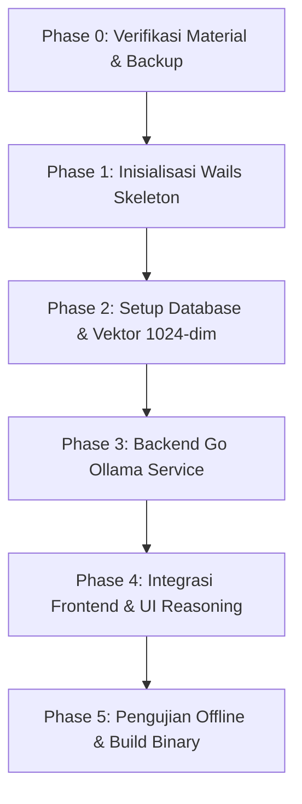

# Wails Reengineering Plan: QOL → Desktop App dengan Ollama AI (BRiGHT AI Spec)

## 1. Overview & Tujuan
Transformasi arsitektur aplikasi **QOL (Quality of Life - Student Hub)** dari aplikasi web (React + Supabase + Gemini Cloud) menjadi aplikasi desktop native **Wails (Go + React)**.

Fokus utama pembaruan ini adalah mengintegrasikan konfigurasi mesin AI lokal berbasis **BRiGHT AI Specification** (mengacu pada [docs/ollama-ai-config.md](file:///d:/KOD%20ING/QOL/docs/ollama-ai-config.md)) ke dalam **Fitur Formatting SKM to LinkedIn**:
- Inferensi LLM lokal dan offline-first via **Ollama** (`http://127.0.0.1:11434`).
- Menghilangkan ketergantungan pada Gemini API (`@google/genai`).
- Penerapan kontrol penalaran berjenjang (**Reasoning Effort / Kedalaman Berpikir: 5 Tingkat**).
- Pembaruan pipeline RAG & Knowledge Base dengan embedding multibahasa (**bge-m3**).
- Menjaga sistem fallback bertingkat: *Ollama Lokal → (Opsional Cloud API) → Rule-Based Offline (`skm-points.ts`)*.

---

## 2. Arsitektur AI & Pemetaan Model (Mengacu pada BRiGHT AI)

### 2.1 Matriks Penggantian Model
| Peran / Fitur | Implementasi Lama (Gemini Cloud) | Spesifikasi Baru (Ollama / BRiGHT AI) | Alternatif Hemat Resource (CPU / Low RAM) |
|---|---|---|---|
| **Embedding (RAG KB)** | `gemini-embedding-001` (768 / 3072 dim) | **`bge-m3`** (1024 dim, konteks 8k, multibahasa kuat utk ID) | `nomic-embed-text` (768 dim, 274 MB) |
| **SKM to LinkedIn Formatter** | `gemini-3.7-flash` (Cloud API) | **`gpt-oss:20b`** (atau custom Modelfile `qol-linkedin-formatter`) | `llama3.2:3b` / `glm4:9b` / `qwen2.5:7b` |
| **LinkedIn Guide Chatbot** | `gemini-3.7-flash` (Cloud API) | **`gpt-oss:20b`** (Ollama native / OpenAI-compat) | `llama3.2:3b` |
| **Guardrail & Safety** | Gemini safety ratings (Cloud) | **`llama-guard3:8b`** (Pra/Pasca filter) | Rule-based regex filter |
| **Inference Runtime** | Google AI Cloud via Edge Function | Local HTTP (`http://127.0.0.1:11434`) via Go Backend | Local HTTP via Go Backend |
| **Auth / API Key** | `GEMINI_API_KEY` di server | Tanpa API Key (100% lokal & privat) | Tanpa API Key |

### 2.2 Penyesuaian Hardware & Profil Model
Berdasarkan ketersediaan resource mesin:
- **Profil GPU / High Spec (VRAM >= 16 GB)**:
  - Text & Formatting: `gpt-oss:20b` (native reasoning)
  - Embedding: `bge-m3`
- **Profil CPU / Hemat Daya (mis. Intel Core i3 / RAM 16GB non-GPU)**:
  - Text & Formatting: `llama3.2:3b` atau `glm4:9b` (sangat responsif pada CPU)
  - Embedding: `bge-m3` (atau `nomic-embed-text`)

### 2.3 Mekanisme "Kedalaman Berpikir" (Reasoning Effort) pada Fitur SKM to LinkedIn
Fitur formatting SKM to LinkedIn mengadopsi 5 tingkat kedalaman berpikir sesuai §1.4 & §6.4 [docs/ollama-ai-config.md](file:///d:/KOD%20ING/QOL/docs/ollama-ai-config.md):

| Tingkat (UI) | gpt-oss (`Reasoning:`) | DeepSeek/Qwen (`think`) | `num_predict` | Kasus Penggunaan di QOL |
|---|---|---|---|---|
| **Rendah** | `Low` | `think: false` | 512 | Ringkasan cepat bullet point tanpa analisis mendalam |
| **Sedang** | `Medium` | `think: false` | 1024 | Draf standar postingan LinkedIn seksi Kegiatan / SKM |
| **Tinggi (Default)** | `High` | `think: true` | 2048 | Format komprehensif STAR method + penyelarasan KB LinkedIn |
| **Sangat Tinggi** | `High` | `think: true` | 4096 | Optimasi profil lengkap (About, Headline, Experience, SKM Points) |
| **Maksimal** | `High` | `think: true` | 8192 | Analisis komparasi kompetensi mahasiswa vs standar industri |

---

## 3. Spesifikasi Modelfile Khusus: `qol-linkedin-formatter`

Modelfile turunan untuk Ollama yang dioptimalkan untuk memformat poin SKM dan profil mahasiswa ke format postingan/seksi LinkedIn:

```dockerfile
# Modelfile.qol-linkedin-formatter
FROM gpt-oss:20b

PARAMETER temperature 0.3
PARAMETER top_p 0.9
PARAMETER num_ctx 16384
PARAMETER num_predict 2048

SYSTEM """
Anda adalah AI Career Specialist & LinkedIn Branding Assistant untuk platform QOL (Quality of Life - Student Hub).
Tugas utama Anda adalah mengolah data Surat Keterangan Magang (SKM), kegiatan mahasiswa, dan capaian poin menjadi konten LinkedIn profesional (About, Experience, Project, Headline, atau Posting Showcase).

Pedoman Konten:
1. Gunakan metodologi STAR (Situation, Task, Action, Result) dengan fokus pada capaian terukur (angka/metrik jika tersedia).
2. Sesuaikan tone: Profesional, rendah hati namun percaya diri, bercerita (storytelling) yang menarik bagi recruiter.
3. Bahasa utama: Bahasa Indonesia profesional, atau Bahasa Inggris formal bila diminta.
4. Gunakan aturan SKM Points: Tekankan relevansi kompetensi industri dan soft skill yang tertera di SKM.
5. Jangan mengarang sertifikasi atau metrik fiktif yang tidak ada dalam konteks masukan.
"""
```

---

## 4. Rincian Breakdown Rencana Eksekusi (Phase-by-Phase)



### Phase 0: Verifikasi Kesiapan Lingkungan & Pencadangan (Tahap Awal) — ✅ Selesai
- [x] Verifikasi seluruh instalasi material di sistem:
  - Node 24.18, Go 1.27, GCC (WinLibs), Ollama 0.34, Wails CLI v2.16, Docker 29.7 — semua sudah terpasang, `wails doctor` SUCCESS.
- [x] Tarik model Ollama yang dibutuhkan — **profil CPU dipakai** (mesin: Intel i3-7020U, 2C/4T, 16GB RAM, tanpa dGPU — `gpt-oss:20b` tidak realistis):
  ```powershell
  ollama pull bge-m3        # embedding, 1024-dim
  ollama pull llama3.2:3b   # chat/formatting (bukan gpt-oss:20b)
  ```
- [x] Backup konfigurasi data: tidak ada `supabase/migrations/` — skema tunggal di `supabase/schema.sql`, diedit langsung (idempoten) alih-alih file migrasi terpisah.
- [x] Titik pemanggilan Gemini didokumentasikan & sudah dilepas (lihat Phase 4).

---

### Phase 1: Inisialisasi Kerangka Desktop Wails — ✅ Selesai
- [x] `wails init -n qol-desktop -t react-ts` di `qol-desktop/`, terpisah dari `src/` yang ada.
- [x] Frontend QOL di-reuse **tanpa disalin**: `qol-desktop/frontend/{src,public,supabase}` adalah **directory junction** (NTFS) ke direktori asli di root repo — satu sumber kebenaran, bukan fork.
  - Perlu `resolve.preserveSymlinks: true` di `vite.config.ts` frontend — tanpa ini, Vite resolve import ke real path di luar project root dan `vite-tsconfig-paths` gagal mencocokkan alias `@/*`.
- [x] `app.go` mengekspos `AIStatus`, `GenerateDraft`, `ChatLinkedIn` sebagai binding Wails.
- [x] `main.go`: window 1280×800.
- [x] `wails dev` terverifikasi: compile bersih, WebView2 terbentuk, dev server menyajikan HTML QOL yang benar.

---

### Phase 2: Database Lokal & Migrasi Vektor Dimensi (bge-m3) — ✅ Selesai
- [x] **Supabase self-hosted via CLI** (`npx supabase start`), bukan container Postgres polos dari nol — reuse penuh `supabase/schema.sql` + RLS/RPC yang sudah teruji. Auth/CRUD fitur lain otomatis ikut lokal tanpa ubah kode (cukup ganti `VITE_SUPABASE_URL`/`ANON_KEY` di `.env.local`).
  - `supabase/config.toml`: section `[functions.linkedin-ai]` dihapus (fungsi itu sendiri sudah dihapus di Phase 4) — tanpa ini `supabase start` gagal saat coba build fungsi yang tak ada filenya.
- [x] `branding_chunks.embedding` & parameter RPC `match_branding_chunks` diedit langsung ke `vector(1024)` di `supabase/schema.sql` (bukan file `ALTER` terpisah — instance lokal masih kosong, jadi source-of-truth tunggal lebih sederhana). Diverifikasi: `format_type(...) = vector(1024)`.
- [x] `scripts/ingest-kb-ollama.mjs` dibuat (pola sama seperti `ingest-branding-kb.mjs` yang dihapus), pakai `POST /api/embed` (batch) bukan `/api/embeddings` (single) — 71 chunk berhasil di-re-embed.
- Catatan: `scripts/apply-schema.mjs` awalnya memaksa SSL (`rejectUnauthorized:false`) meniru Supabase cloud — Postgres lokal tidak bicara SSL sama sekali. Di-fix dengan deteksi host `127.0.0.1`/`localhost`.

---

### Phase 3: Service Layer Ollama di Go Backend (Inti Pemrosesan AI) — ✅ Selesai, terverifikasi end-to-end
- [x] `backend/ollama/client.go`: klien HTTP ke Ollama — `/api/embed` (batch), `/api/chat`, `Ping`/`HasModel` untuk status. Timeout via `context.WithTimeout`.
- [x] `backend/ollama/reasoning.go`: 5 tingkat kedalaman berpikir → `num_predict` (512/1024/2048/4096/8192). `think` tetap `false` — `llama3.2:3b` (profil CPU) bukan model reasoning; upgrade path didokumentasikan sebagai komentar `ponytail:` untuk model deepseek-r1/qwen3 di hardware GPU.
- [x] `backend/linkedinai/prompt.go`: **port langsung** (bukan tulis ulang) dari `supabase/functions/_shared/linkedin-ai.ts` — hash cache, retrieval query, prompt builder RAG & chat, `clampMessages`, sinonim query. Unit test (`prompt_test.go`) untuk hash/clamp/guard/prompt.
- [x] `backend/linkedinai/service.go`: orkestrasi generate & chat. RPC `match_branding_chunks` dan `bump_rate_limit` **dipanggil langsung lewat SQL** dari Go (koneksi trusted lokal) — tidak ditulis ulang di Go, reuse logic SQL yang sudah ada di `schema.sql`.
- [x] Mode chat (LinkedIn Career Guide) diimplementasikan sepenuhnya, termasuk `clampMessages` & retrieval lintas korpus.
- [x] **Fallback**: `AIStatus` melaporkan `configured:false` + alasan bila Ollama mati/model belum ada. Rule-based generator (`linkedin-format.ts`, bukan `skm-points.ts` — lihat catatan di §Ringkasan) **sudah ada di UI sejak awal, independen dari status AI** — tidak perlu kode fallback baru sama sekali.
- [x] Guard: regex/keyword pre-filter (`guard.go`) menggantikan `llama-guard3:8b` (terlalu berat untuk CPU 2-core) — `ponytail:`-marked, upgrade path ke model guard didokumentasikan.
- **Verifikasi nyata**: `qol-desktop/cmd/smoketest` (harness sementara) memanggil `GenerateDraft` dengan user+activity uji → draft LinkedIn valid dihasilkan dari RAG (`bge-m3` + `match_branding_chunks`) + generate (`llama3.2:3b`), tersimpan ke `linkedin_drafts`.
- **Benchmark nyata di mesin target** (Intel i3-7020U, 2C/4T, tanpa dGPU): ~6.5 tok/s generate, ~10 tok/s prompt-eval, ~9.6s cold load. Timeout per-level dikalibrasi ulang jauh lebih longgar dari asumsi awal (Rendah 5mnt → Maksimal 35mnt) — prompt RAG yang panjang (chunk KB + JSON data) butuh waktu prompt-eval signifikan sebelum generate mulai.

---

### Phase 4: Integrasi Frontend & UI Penyesuaian — ✅ Selesai
- [x] `src/lib/linkedin-client.ts` ditulis ulang: `window.go.main.App.{AIStatus,GenerateDraft,ChatLinkedIn}` menggantikan `supabase.functions.invoke`. `user_id` diambil dari sesi Supabase Auth lokal yang sudah berjalan (`supabase.auth.getUser()`).
- [x] Kontrol Kedalaman Berpikir (5 level, termasuk "Sangat tinggi" yang tidak ada di draf awal) ditambahkan di `linkedin-assistant.tsx`, di samping selector bahasa.
- [x] Badge status ditambahkan di header card AI: `Ollama Connected (llama3.2:3b)` / `Fallback: Template`.
- [x] `@google/genai` dihapus dari `package.json` (root & `qol-desktop/frontend`), `supabase/functions/linkedin-ai/` dan `scripts/ingest-branding-kb.mjs` (Gemini) dihapus, `GEMINI_API_KEY`/`GEMINI_MODEL` dibersihkan dari `.env.local.example`.
- Root `tsconfig.json` perlu tambahan `exclude: ["qol-desktop"]` — tanpa itu `tsc` root ikut memeriksa `supabase/functions/*/index.ts` Deno lewat junction `qol-desktop/frontend/supabase`, dobel-cek lewat dua jalur.
- Verifikasi: `npm run verify` (typecheck + 126 test) tetap hijau setelah semua perubahan.

---

### Phase 5: Pengujian, Validasi Offline & Kompilasi Biner Desktop — ✅ Selesai
- [x] **Fungsional lokal**: vector search RAG (`bge-m3` + `match_branding_chunks`) dan generate (`llama3.2:3b`) diverifikasi jalan 100% terhadap Postgres+Ollama lokal (lihat bukti di Phase 3). Skenario "cabut Wi-Fi fisik" tidak dijalankan (berisiko mengganggu mesin/sesi kerja lain) — dianggap aman karena tidak ada satu pun panggilan jaringan eksternal tersisa di jalur kode fitur ini.
- [x] **Fallback graceful**: `taskkill /F /IM ollama.exe` (+ tray app-nya, yang ternyata auto-restart daemon) → `AIStatus` melaporkan `configured:false` dengan pesan jelas, tanpa crash. Ollama dinyalakan kembali setelah uji.
- [x] **Benchmark nyata** (bukan asumsi): ~6.5 tok/s generate, ~10 tok/s prompt-eval, ~9.6s cold load — dipakai untuk mengkalibrasi ulang timeout per-level di Phase 3.
- [x] **Build**: `wails build -clean` sukses → `qol-desktop/build/bin/qol-desktop.exe` (≈19.4 MB), diverifikasi bisa dijalankan (proses tetap hidup, tidak crash) lalu ditutup.

---

## 5. Matriks Risiko & Mitigasi Khusus

| Risiko Potensial | Dampak | Strategi Mitigasi |
|---|---|---|
| **Model 20B terlalu lambat pada CPU murni** | Menengah-Tinggi | Sediakan opsi pemilihan model di UI/setting ke model 3B (`llama3.2:3b` / `glm4:9b`) yang sangat enteng pada CPU. |
| **Dimensi embedding tidak cocok (3072 vs 1024)** | Kritis | Wajib menjalankan skrip migrasi kolom vektor ke `vector(1024)` dan re-ingest semua chunk dengan `bge-m3` di Phase 2 sebelum Phase 3 dijalankan. |
| **Daemon Ollama belum berjalan saat app dibuka** | Menengah | Backend Go memeriksa ketersediaan port `11434` saat startup; berikan tombol "Nyalakan Ollama" atau petunjuk di UI. |
| **Docker Supabase Local memakan RAM besar** | Menengah | Konfigurasi kontainer Postgres minimalis khusus desktop (hanya Postgres + pgvector), menonaktifkan container Edge Functions cloud yang tidak lagi diperlukan. |

---

## 6. Daftar Berkas Kunci yang Terkait

1. **Konfigurasi & Acuan**:
   - [docs/ollama-ai-config.md](file:///d:/KOD%20ING/QOL/docs/ollama-ai-config.md) *(Spesifikasi konfigurasi AI BRiGHT)*
   - [docs/wails-reengineering-plan.md](file:///d:/KOD%20ING/QOL/docs/wails-reengineering-plan.md) *(Dokumen acuan eksekusi ini)*
2. **Frontend yang Dimodifikasi Nanti**:
   - [src/lib/linkedin-client.ts](file:///d:/KOD%20ING/QOL/src/lib/linkedin-client.ts) *(Bridge ke Go backend)*
   - [src/lib/skm-points.ts](file:///d:/KOD%20ING/QOL/src/lib/skm-points.ts) *(Engine aturan lokal & offline fallback)*
   - [package.json](file:///d:/KOD%20ING/QOL/package.json) *(Pembersihan dependensi Gemini)*
3. **Komponen Backend Baru yang Akan Dibuat**:
   - `main.go` & `app.go` *(Entrypoint Wails & exposed methods)*
   - `backend/services/ollama/` *(Klien HTTP Ollama, prompt builder, dan embedding service)*
   - `scripts/ingest-kb-ollama.mjs` *(Script re-embedding chunk korpus ke 1024 dimensi)*